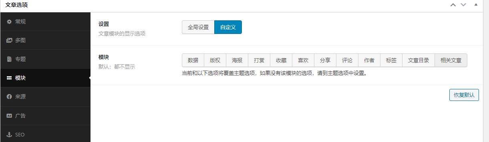

# 春松客服 W3 模板

[春松客服开发者会议](https://raw.githubusercontent.com/cskefu/.github/main/w3/templates/devconf.md)

# 使用疑问 & 帮助

创建 Issue 描述问题：[https://github.com/cskefu/cskefu-docs/issues](https://github.com/cskefu/cskefu-docs/issues)

# FAQ

## 如何发布文章到【投票】？

投票是投票相关的列表：在网站导航【社区-社区治理】中。

<https://www.cskefu.com/votes/>

在撰写文章时，为文章添加标签 `vote`发布后，即可展示到投票列表。

## 发布文章如何隐藏作者

默认情况下，浏览发布后的文章带有作者信息，可以隐藏作者信息，方法：

在文章编辑页面，进入【文章选项】，选择【模块】，设置中选择【自定义】，并确认有如下设定：

发布文章即可隐藏作者。
